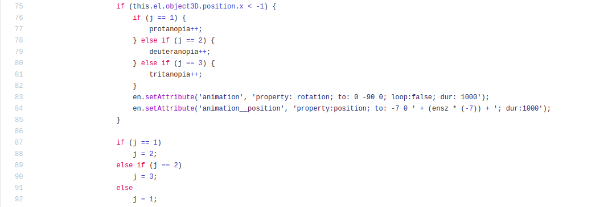
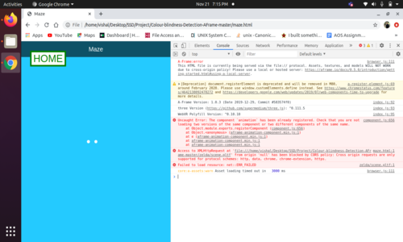

## SSD Group 13 Project - Colour blindness detection AFrame

### Objective: 
To implement Color blindness tests from the established literature as a web-application to digitally test color-blindedness in users. 

### Solution Approach:
The aim of the project is to provide the users a way of detecting their specific colorblindness with the help of specific color maze.

### Rule:

* The maze-walls are designed in a way that the person with normal eye vision will see different colors on his walls of the pathways, but will appear different to the person with color blindness.

* The user is prompted to turn left in case he sees the maze walls of different color or turn right if the maze walls are of same color.

* At the end of course user gets the prompt about the type of color blindness he is facing.

### Score Calulation:
* User has to go through the total of 15 levels which will cover the tests for all the three deficiencies that is, Protanopia, Deuteranopia and Tritanopia.

* 15 levels are furhter divided into 5 subsets and each subset will contain tests for the three deficiencies in the same manner that is mentioned above, that means, first three levels would be the first level of protanopia, the first level of deuterenapia and the first level of tritonopia respectively, the next three levels would be the second level of the above deficiencies and this will continue in the same manner.

* Below is the screenshot of the code which checks the type of deficiency that is present in that level and also how scores are getting calculated for each deficiency.

* In the above code defeciencies are alloted with integers from 1 to 3 that is for protanopia its 1, for deutranopia its 2 and for tritanopia its 3, j is a variable initialized with 1, on each turn it checks for left or right turn and if its left then it increments the variable corresponds to the deficiency present on that level and then it changes the value of j with the integer corresponding to the next deficiency. After completing the last level, the value of all the varibles (i.e protanopia, deuteranopia and tritanopia variable) will be displayed in the form of score.

### Files:

* *index.html* is the hompage. 
* *maze.html* is used to detect color blindness.
* *instructions.html* has all the instructions for the game.

### References:
* https://aframe.io/
* https://www.color-blindness.com/coblis-color-blindness-simulator/
* Red-green colour blindness chart: https://www.color-blindness.com/red-green-color-blindness/
* colour selection:(1)https://venngage.com/blog/color-blind-friendly-palette/ 
* colour selection:(2)https://www.google.com/url?sa=t&source=web&rct=j&url=https://www.disabled-world.com/disability/accessibility/websitedesign/color-spectrum-chart.php&ved=2ahUKEwj20KyXgY7tAhUihuYKHU9DCbUQFjAAegQIARAB&usg=AOvVaw238CN_Oe68WICz6WrqyKoP
* https://www.colorlitelens.com/color-blindness-test.html

### Links for project
The github page link will be provided as soon as we make the repository public.

### Note:
* You may face this issue when you try to start the maze game. Below is the screenshot of the console of the page 

* Given Below link Which is useful for Resolution if in case you come across the error like this.

* [Resolve](https://help.symantec.com/cs/DCS1.0/DCS1_0/v107680513_v99309261/Enabling-CORS?locale=EN_US) this issue.

